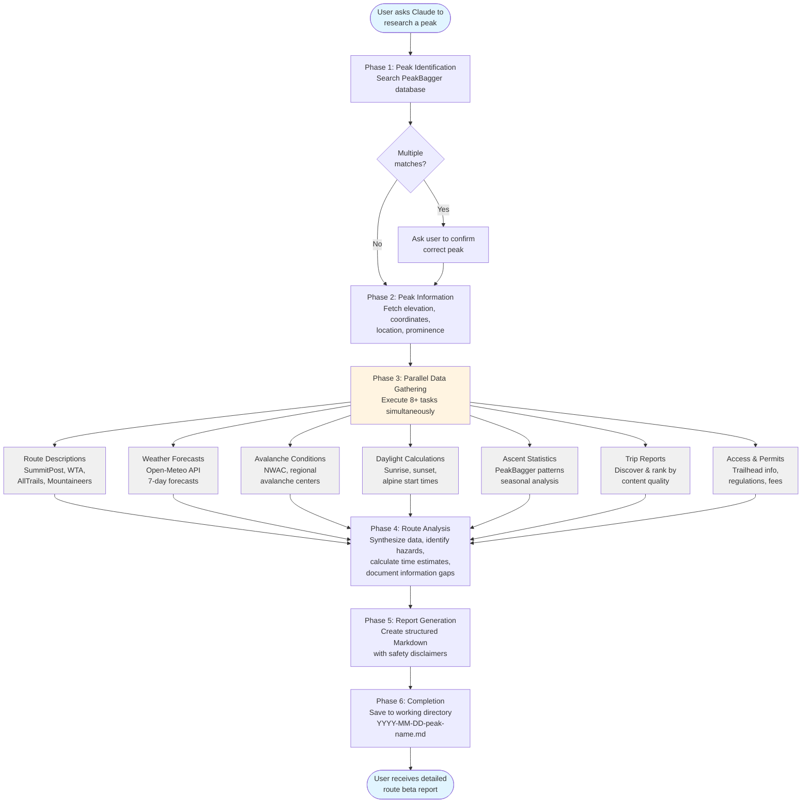

<h1 align="center">Mountaineering Skills for Claude Code</h1>

<p align="center">
  <a href="https://github.com/dreamiurg/claude-mountaineering-skills/releases">
    
  </a>
  <a href="https://conventionalcommits.org">
    
  </a>
  <a href="https://opensource.org/licenses/MIT">
    
  </a>
  <a href="https://docs.claude.com/claude-code">
    
  </a>
  <a href="https://github.com/dreamiurg/claude-mountaineering-skills/issues">
    
  </a>
</p>

<h4 align="center">Automated mountain route research for North American peaks, built for <a href="https://claude.com/claude-code" target="_blank">Claude Code</a>.</h4>

<p align="center">
  <a href="#quick-start">Quick Start</a> •
  <a href="#how-it-works">How It Works</a> •
  <a href="#features">Features</a> •
  <a href="#recent-updates">Recent Updates</a> •
  <a href="#installation">Installation</a> •
  <a href="#support">Support</a>
</p>

Simply ask Claude to research any mountain, and the route-researcher skill aggregates data from 10+ specialized mountaineering sources to generate detailed Markdown route beta reports. Each report includes current weather forecasts, avalanche conditions, daylight calculations, synthesized trip reports, and detailed route information - transforming 3-5 hours of manual research into a 3-5 minute automated workflow with safety-first documentation and explicit information gap tracking.

**Example Reports:**

- **[Mount Si](skills/route-researcher/examples/2025-10-23-mount-si.md)** - Popular 4,167 ft front-range hike with 3,150 ft elevation gain. Great example of a heavily-trafficked trail with abundant trip reports.

- **[Mount Adams (South Climb)](skills/route-researcher/examples/2025-11-06-mount-adams.md)** - Washington's second-highest peak at 12,280 ft. Glaciated volcano climb with 6,700 ft elevation gain, showcasing weather forecasts, freezing level alerts, and avalanche conditions.

- **[Wolf Peak](skills/route-researcher/examples/2025-11-06-wolf-peak.md)** - Challenging 5,813 ft scramble with exposed Class 3-4 summit block. Demonstrates route analysis for technical terrain with limited trip report data.

---

## Quick Start

Start a new Claude Code session in your terminal and run:

```bash
% claude
> /plugin marketplace add dreamiurg/claude-mountaineering-skills

> /plugin install mountaineering-skills@mountaineering-skills-marketplace
```

Restart Claude Code. Then simply ask:

```
"Research Mount Rainier"
```

Claude will automatically generate a detailed route beta report in your current directory.

**Key Features:**
- 🏔️ **Multi-Source Research** - Aggregates data from 10+ mountaineering websites
- ⚠️ **Safety First** - Explicit disclaimers and information gap tracking
- 📍 **Current Conditions** - Weather forecasts, avalanche reports, daylight calculations
- 🌦️ **Comprehensive Reports** - Route descriptions, trip reports, permit information

---

## How It Works

The route-researcher skill follows a six-phase workflow to generate complete route beta reports:



**Key Features:**

- **Parallel Execution**: Phase 3 runs multiple data gathering tasks simultaneously for speed
- **Graceful Degradation**: Continues with available data if sources fail, documents gaps explicitly
- **Two-Tier Fetching**: Uses WebFetch first, automatically falls back to Cloudflare-bypassing tools when needed
- **Quality Ranking**: Prioritizes detailed trip reports over brief logs for better route insights
- **Safety First**: Prominent AI-generated content disclaimers and manual verification links throughout

## Installation

### Prerequisites

- [Claude Code](https://docs.claude.com/claude-code) installed
- [uv](https://docs.astral.sh/uv/) (optional, for Python tools)

### Install Plugin

This repo contains both marketplace and skills. It add it to Claude Code, run the following commands:

```bash
% claude
> /plugin marketplace add dreamiurg/claude-mountaineering-skills
  ⎿  Successfully added marketplace: mountaineering-skills-marketplace

> /plugin install mountaineering-skills@mountaineering-skills-marketplace
  ⎿  ✓ Installed mountaineering-skills. Restart Claude Code to load new plugins.
```

The plugin installs Python dependencies automatically if `uv` is available. If not, see [Manual Installation](#manual-installation) below.

### Verify Installation

In any Claude Code session:

```bash
"What skills are available?"
```

You should see `route-researcher` listed.

## Usage

Simply ask Claude to research a mountain peak:

```bash
"Research Mt Baker"
"Get route beta for Forbidden Peak"
"I'm planning to climb Sahale Peak, can you research the route?"
```

Claude will automatically invoke the route-researcher skill and generate a thorough route beta report in your current directory.

### Generated Output

Reports are created as Markdown files in your current working directory (format: `YYYY-MM-DD-peak-name.md`) with complete route information, current conditions, weather forecasts, trip reports, and safety disclaimers. See [Example Reports](#example-reports) above for what the output looks like.

## Features

### Multi-Source Data Gathering

The skill aggregates information from multiple specialized mountaineering websites:

- **[PeakBagger](https://www.peakbagger.com)**: Peak information, coordinates, elevation
- **[SummitPost](https://www.summitpost.org)**: Route descriptions, conditions, beta
- **[Washington Trails Association (WTA)](https://www.wta.org)**: Trail reports and conditions
- **[AllTrails](https://www.alltrails.com)**: Trail information and reviews
- **[The Mountaineers](https://www.mountaineers.org)**: Route guides and resources
- **Weather**: [Mountain-Forecast.com](https://www.mountain-forecast.com), [NOAA/NWS](https://www.weather.gov) point forecasts
- **Avalanche**: Regional avalanche centers ([NWAC](https://nwac.us), etc.) when applicable
- **Trip Reports**: Multiple sources including [CascadeClimbers](https://cascadeclimbers.com), [PeakBagger](https://www.peakbagger.com), [Mountain Project](https://www.mountainproject.com)

**Note:** The quality of the generated report depends on the availability of peak information on these sources. If your target peak lacks coverage on these websites, the skill may produce limited output. The skill works best for well-documented peaks in North America.

---

## Recent Updates

**v3.3.0** (Nov 6, 2025)
- Added example route beta reports for Mount Adams and Wolf Peak

**v3.2.0** (Oct 24, 2025)
- Expanded geographic scope from Pacific Northwest to North America

**v3.1.0** (Oct 24, 2025)
- Upgraded peakbagger-cli to v1.7.0 with restructured skill workflow

**v3.0.0** (Oct 23, 2025)
- Major update with ascent analysis capabilities
- Temporal pattern analysis and GPX track availability
- Enhanced trip report discovery

**v2.0.0** (Oct 21, 2025)
- Integrated peakbagger-cli v1.0.0 with new resource-action command pattern
- Optimized Phase 2 data gathering with parallel execution (3-4x speedup)
- Added commit and PR templates with Conventional Commits

See [CHANGELOG.md](CHANGELOG.md) for complete version history.

---

### Safety-First Approach

- Prominent AI-generated content disclaimers
- Explicit information gap documentation
- Manual verification links for all data sources
- Clear safety warnings and hazard information

### Graceful Degradation

If data sources are unavailable:
- Skill continues with available sources
- Notes missing data in "Information Gaps" section
- Provides manual check links
- Always generates a report, even with partial data

## Dependencies

### PeakBagger CLI

Uses [peakbagger-cli](https://github.com/dreamiurg/peakbagger-cli) to retrieve peak information and trip reports from PeakBagger.com. Version pinned to `v1.7.0` for stability.

### Python Tools

Includes Python utilities for weather forecasts, avalanche conditions, and daylight calculations. See [skills/route-researcher/tools/README.md](skills/route-researcher/tools/README.md) for details.

## Updates

Check for plugin updates:

```bash
/plugin list
```

Update to the latest version:

```bash
/plugin update mountaineering-skills
```

## Contributing

Contributions are welcome! See [CONTRIBUTING.md](CONTRIBUTING.md) for guidelines.

## License

MIT License - see [LICENSE](LICENSE) file for details.

---

## Support

- **Issues**: [GitHub Issues](https://github.com/dreamiurg/claude-mountaineering-skills/issues)
- **Discussions**: [GitHub Discussions](https://github.com/dreamiurg/claude-mountaineering-skills/discussions)

---

## Disclaimer

This tool generates AI-assisted research and should be used as a starting point only. Always verify critical information from primary sources, check current conditions, and use your own judgment for trip planning and safety decisions.

The mountains are inherently dangerous. You are responsible for your own safety.
