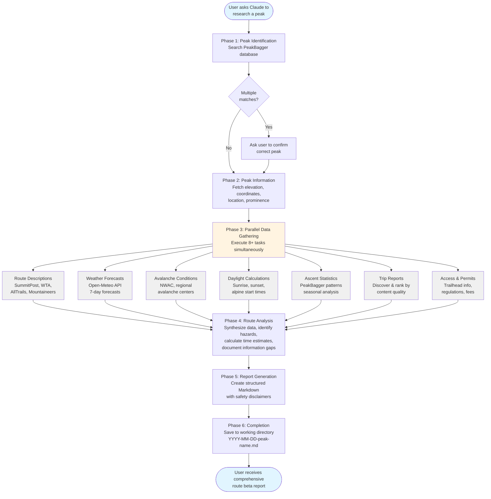

# Mountaineering Skills for Claude Code

[](https://github.com/dreamiurg/claude-mountaineering-skills/releases)
[](https://conventionalcommits.org)
[](https://opensource.org/licenses/MIT)
[](https://docs.claude.com/claude-code)
[](https://github.com/dreamiurg/claude-mountaineering-skills/issues)

A Claude Code plugin that automates mountain route research for North American peaks. Simply ask Claude to research any mountain, and the route-researcher skill aggregates data from 10+ specialized mountaineering sources (PeakBagger, SummitPost, WTA, AllTrails, Mountain Project, and more) to generate comprehensive Markdown route beta reports. Each report includes current weather forecasts, avalanche conditions, daylight calculations, synthesized trip reports, and detailed route information - transforming 3-5 hours of manual research into a 3-5 minute automated workflow with safety-first documentation and explicit information gap tracking.

## How It Works

The route-researcher skill follows a six-phase workflow to generate comprehensive route beta reports:



**Key Features:**

- **Parallel Execution**: Phase 3 runs multiple data gathering tasks simultaneously for speed
- **Graceful Degradation**: Continues with available data if sources fail, documents gaps explicitly
- **Two-Tier Fetching**: Uses WebFetch first, automatically falls back to Cloudflare-bypassing tools when needed
- **Quality Ranking**: Prioritizes detailed trip reports over brief logs for better route insights
- **Safety First**: Prominent AI-generated content disclaimers and manual verification links throughout

## Example Reports

See what the plugin generates. Each report includes route descriptions, current conditions, weather forecasts, trip reports, and safety information:

- **[Mount Si](skills/route-researcher/examples/2025-10-23-mount-si.md)** - Popular 4,167 ft front-range hike with 3,150 ft elevation gain. Great example of a heavily-trafficked trail with abundant trip reports.

- **[Mount Adams (South Climb)](skills/route-researcher/examples/2025-11-06-mount-adams.md)** - Washington's second-highest peak at 12,280 ft. Glaciated volcano climb with 6,700 ft elevation gain, showcasing weather forecasts, freezing level alerts, and avalanche conditions.

- **[Wolf Peak](skills/route-researcher/examples/2025-11-06-wolf-peak.md)** - Challenging 5,813 ft scramble with exposed Class 3-4 summit block. Demonstrates route analysis for technical terrain with limited trip report data.

## Installation

### Prerequisites

- [Claude Code](https://docs.claude.com/claude-code) installed
- [uv](https://docs.astral.sh/uv/) (optional, for Python tools)

### Install Plugin

This repo contains both marketplace and skills. It add it to Claude Code, run the following commands:

```bash
% claude
> /plugin marketplace add dreamiurg/claude-mountaineering-skills
  ⎿  Successfully added marketplace: mountaineering-skills-marketplace

> /plugin install mountaineering-skills@mountaineering-skills-marketplace
  ⎿  ✓ Installed mountaineering-skills. Restart Claude Code to load new plugins.
```

The plugin installs Python dependencies automatically if `uv` is available. If not, see [Manual Installation](#manual-installation) below.

### Verify Installation

In any Claude Code session:

```bash
"What skills are available?"
```

You should see `route-researcher` listed.

## Usage

Simply ask Claude to research a mountain peak:

```bash
"Research Mt Baker"
"Get route beta for Forbidden Peak"
"I'm planning to climb Sahale Peak, can you research the route?"
```

Claude will automatically invoke the route-researcher skill and generate a comprehensive route beta report in your current directory.

### Generated Output

Reports are created as Markdown files in your current working directory (format: `YYYY-MM-DD-peak-name.md`) with comprehensive route information, current conditions, weather forecasts, trip reports, and safety disclaimers. See [Example Reports](#example-reports) above for what the output looks like.

## Features

### Multi-Source Data Gathering

The skill aggregates information from multiple specialized mountaineering websites:

- **PeakBagger**: Peak information, coordinates, elevation
- **SummitPost**: Route descriptions, conditions, beta
- **Washington Trails Association (WTA)**: Trail reports and conditions
- **AllTrails**: Trail information and reviews
- **The Mountaineers**: Route guides and resources
- **Weather**: Mountain-Forecast.com, NOAA/NWS point forecasts
- **Avalanche**: Regional avalanche centers (NWAC, etc.) when applicable
- **Trip Reports**: Multiple sources including CascadeClimbers, PeakBagger, Mountain Project

**Note:** The quality of the generated report depends on the availability of peak information on these sources. If your target peak lacks coverage on these websites, the skill may produce limited output. The skill works best for well-documented peaks in North America.

### Safety-First Approach

- Prominent AI-generated content disclaimers
- Explicit information gap documentation
- Manual verification links for all data sources
- Clear safety warnings and hazard information

### Graceful Degradation

If data sources are unavailable:
- Skill continues with available sources
- Notes missing data in "Information Gaps" section
- Provides manual check links
- Always generates a report, even with partial data

## Dependencies

### PeakBagger CLI

This plugin uses [peakbagger-cli](https://github.com/dreamiurg/peakbagger-cli) for retrieving peak information and trip reports from PeakBagger.com.

**Current Version:** Pinned to `v1.7.0`

The CLI is run via `uvx` without installation. The version is pinned to prevent breaking changes:
```bash
uvx --from git+https://github.com/dreamiurg/peakbagger-cli.git@v1.7.0 peakbagger peak search ...
```

**Command Structure (v1.0.0+):** Resource-action pattern:
- `peakbagger peak search` - Search for peaks by name
- `peakbagger peak show` - Get detailed peak information
- `peakbagger peak stats` - Analyze ascent statistics and patterns
- `peakbagger peak ascents` - List individual ascents with filtering

**Future:** Once peakbagger-cli is published to PyPI, the plugin will use semantic version constraints (`>=1.0,<2.0`) to automatically receive patch and minor updates while protecting against breaking changes.

### Python Tools

The plugin includes Python utilities for enhanced data gathering (weather forecasts, avalanche conditions, daylight calculations). See [skills/route-researcher/tools/README.md](skills/route-researcher/tools/README.md) for details on available tools, manual installation, and troubleshooting.

## Updates

Check for plugin updates:

```bash
/plugin list
```

Update to the latest version:

```bash
/plugin update mountaineering-skills
```

## Contributing

Found a bug or have a feature request? Please [open an issue](https://github.com/dreamiurg/claude-mountaineering-skills/issues).

Pull requests welcome! This project follows [Conventional Commits](https://www.conventionalcommits.org/) for automated semantic versioning.

### Commit Message Format

```
<type>: <description>

[optional body]

[optional footer]
```

**Types that trigger releases:**
- `feat:` - New feature (MINOR version bump: 0.1.0 → 0.2.0)
- `fix:` - Bug fix (PATCH version bump: 0.1.0 → 0.1.1)
- `perf:` - Performance improvement (PATCH version bump)

**Types that don't trigger releases:**
- `docs:` - Documentation changes
- `chore:` - Maintenance, dependencies, configs
- `refactor:` - Code restructuring
- `test:` - Test changes
- `ci:` - CI/CD changes
- `build:` - Build system changes

**Breaking changes:**
- Add `!` after type: `feat!:` or `fix!:` (MAJOR bump: 0.1.0 → 1.0.0)
- Or add `BREAKING CHANGE:` in footer

### Git Commit Template

Configure your local repository to use the commit message template:

```bash
git config commit.template .gitmessage
```

### Pull Request Guidelines

- PR titles must follow the same format: `type: description`
- Use the PR template (auto-populated when creating PR)
- Ensure all tests pass and code quality checks succeed

See [.gitmessage](.gitmessage) for examples and detailed guidelines.

## License

MIT License - see [LICENSE](LICENSE) file for details.

## Disclaimer

This tool generates AI-assisted research and should be used as a starting point only. Always verify critical information from primary sources, check current conditions, and use your own judgment for trip planning and safety decisions.

The mountains are inherently dangerous. You are responsible for your own safety.
